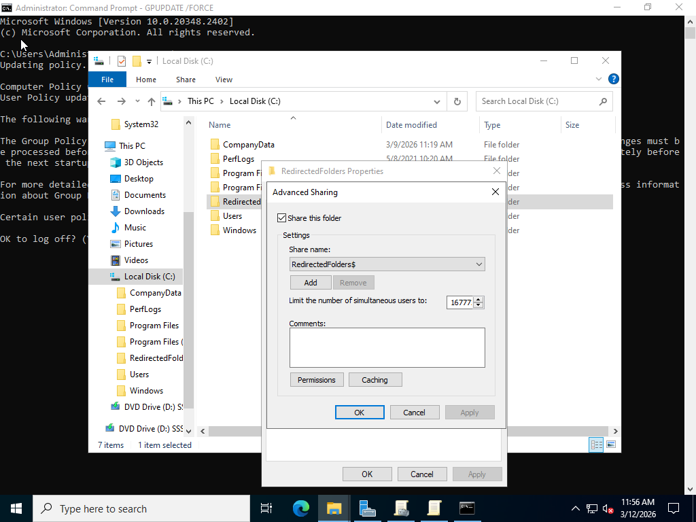
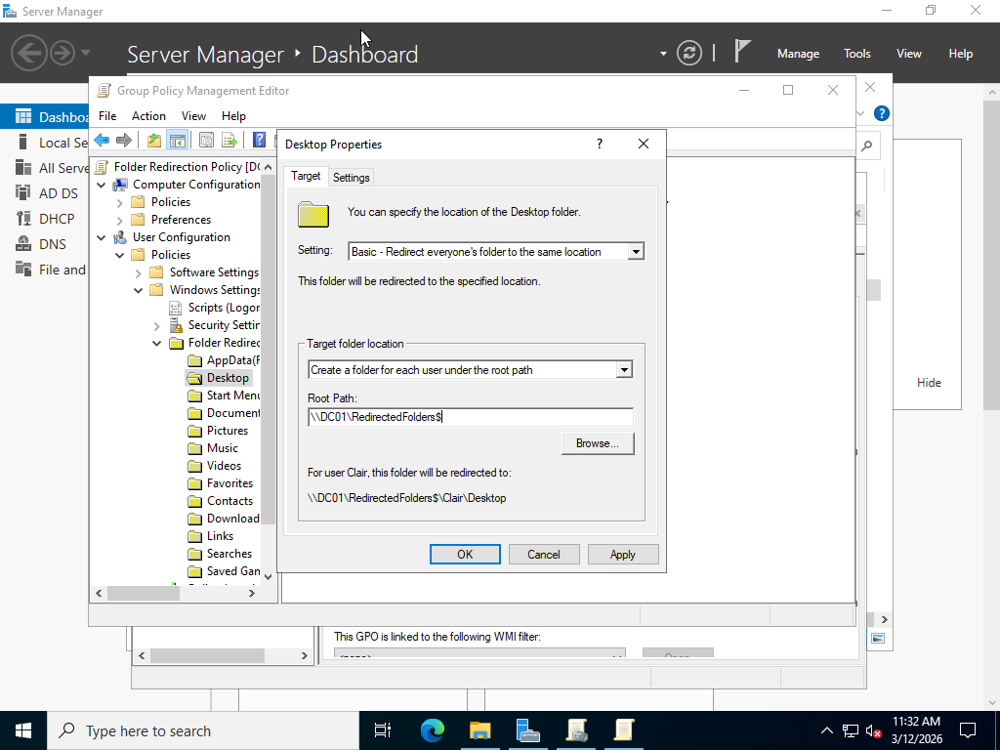
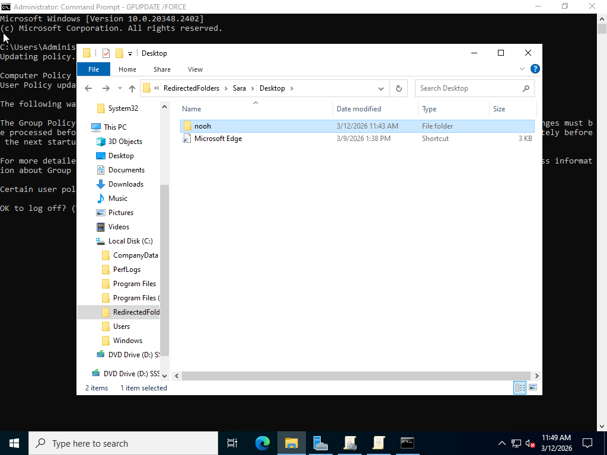

# Folder-Redirection-Lab

## Overview
This lab demonstrates how to configure Folder Redirection using Group Policy in a Windows Server environment.  
The goal is to store user folders on the server instead of the local machine.

Technologies used:

- Active Directory
- Group Policy
- File Server
- Windows Server

---

## Lab Environment

DC01 (Domain Controller)

Client PC joined to the domain

Shared folder for redirected user data

---

## Configuration Steps

1. Created a shared folder on the server to store user data.

2. Configured NTFS permissions for authenticated users.

3. Created a new Group Policy Object for Folder Redirection.

4. Configured the Documents folder redirection for domain users.

5. Applied the policy and updated the client using: gpupdae/force
6. Tested the configuration by creating files in the redirected folder.

---

## Result

User documents are automatically stored on the server instead of the local computer.

This improves:

- Data backup
- Centralized storage
- User profile management

---

## Screenshots

### Shared Folder Configuration

### Folder Redirection Policy

### User Folder Created on Server

### Client Test

